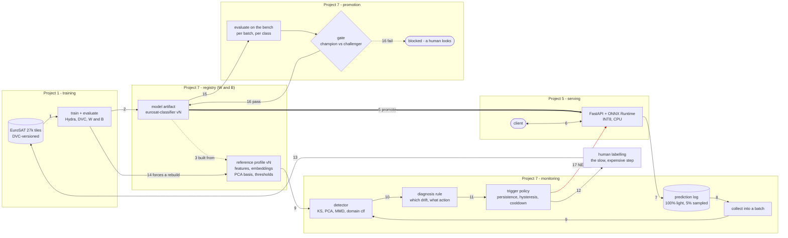
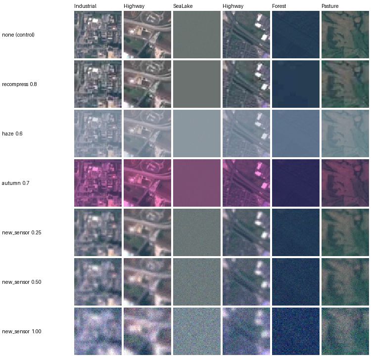
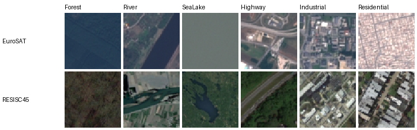
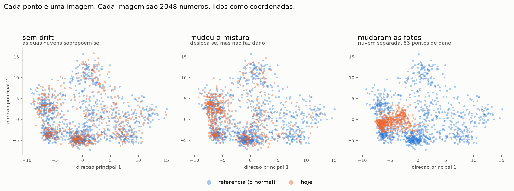

# Closing the MLOps loop: drift monitoring and automated retraining

This is the third part of a chain. In [Project1](../Project1) I trained a ResNet50
to classify EuroSAT land-use tiles. In [Project5](../Project5) I turned it into an
HTTP service. Both of those end the moment the model answers a request — and that
turned out to be exactly where the interesting problem starts, because a model in
production doesn't fail the way software fails.

Software breaks loudly: an exception, a 500, an alarm. A model rots quietly. The API
keeps returning `200 OK` with `confidence: 0.94`, the answer is wrong, and nothing
anywhere says so.

So the question this project exists to answer is:

> **How do I know the model has degraded, when production has no labels?**

Any answer is indirect. If I can't measure the error, I can at least measure whether
the world changed, and treat that as a warning sign. Drift detection is a proxy for
degradation, never a measurement of it, and a fair bit of what follows is about
keeping those two apart.

Everything below was measured on my own machine against a bench I built for the
purpose. I've left in the numbers that surprised me, and the five bugs I found in my
own code by checking things I assumed I already knew.

---

## The cycle



Arrow **4** — registering the pair as one bundle — is the box `REG` itself: model and
profile are versioned and promoted together, never separately. Arrow **17** is drawn
in red because it is the one that must not exist.

### Every arrow

**1 · data → training.** DVC versions both the data and the pipeline, so `dvc repro`
reproduces a run exactly. Git holds the code, DVC holds the data and the process,
W&B holds what happened when it ran. Three versioning systems, each owning one thing.

**2 · training → model artifact.** The checkpoint is exported to ONNX and quantised
to INT8. This project changed that export to emit **two** outputs — `logits` and the
2048-d `features` — because monitoring needs to know how the model *sees* an image,
and the embedding comes out of the same forward pass for free. Recomputing it later
would mean running the network twice per request.

**3 · model → reference profile.** The dashed arrow is the one most registries get
wrong. The profile — what "normal" looks like — is **not independent of the model**:
its embeddings came out of that model, its PCA basis was fitted on those embeddings,
its thresholds were calibrated by measuring that model against that profile. Swap the
model and every one of those becomes meaningless, and not in a way that raises an
error: in a way that keeps producing plausible numbers on the same dashboard.

**4 · bundle → registry.** So the unit of versioning is the **pair**, never the model
alone. Both artifacts are registered together and carry the evidence — the full
calibration table across 14 batches, the six thresholds, the profile's content hash.
A registry entry that says only "resnet50, 24 MB" cannot support a promotion decision
six months later, when everyone who built it has forgotten why.

**5 · registry → serving.** Deployment is moving an alias. Rollback is moving it back.
Seconds, either way, and the previous version is never overwritten.

**6 · client ⇄ API.** The response shape is unchanged by any of this. The 2048-d
embedding never enters the HTTP body — it would grow responses tenfold and leak an
internal representation to callers.

**7 · API → prediction log.** Two tiers, because you cannot log everything. Every
request writes ~287 bytes: predicted class, confidence, entropy, margin, latency,
dimensions. A sampled fraction *also* writes the image exactly as received and its
embedding — 13 KB. At a million requests a day that's the difference between 287 MB
and 13 GB. So the sampling rate is really a storage budget, and someone has to pick it.

One thing worked out conveniently. The signal that turned out to predict damage best
(`outKS`, Spearman +0.95 against measured accuracy loss) is in the cheap tier, the one
we can afford on every request. The expensive tier is there to explain *why*, once
something has already fired.

**8 · log → batch.** Just a format conversion. That was the goal: live traffic should
end up looking like any other batch, so the detector I'd already validated against 11
fabricated batches and one real one runs on production without changes.

**9 · batch + profile → detector.** Each image becomes 2048 numbers; read those as
coordinates and a batch is a cloud of points in 2048 dimensions, projected below onto
the two directions the reference varies most along. Four ways to ask whether the cloud
moved: KS per feature, PCA + KS, MMD with a permutation test, and a domain
classifier. All four were implemented so the choice could be settled by measurement.

**10 · detector → diagnosis.** Written as explicit rules rather than a learned model.
This is the piece that authorises spending money and swapping out a production
artifact, so somebody has to be able to read it and argue with it in a review.

**11 · diagnosis → trigger.** The first component with memory. Everything upstream
looks at one window and forgets; a decision cannot.

**12 · trigger → labelling.** The arrow people expect to point at "training", and it
doesn't. If the drift is a new sensor, retraining on the existing training set
reproduces the existing model — the new distribution simply isn't in it. The new
images exist (arrow 7 kept them) but carry no labels, because production never knows
the answer. **The trigger's real output is a request for human labelling**, and only
after that does a training command mean anything.

**13 · labelling → data.** The slow, expensive, human step. It is the bottleneck of
the entire cycle and no amount of automation removes it.

**14 · new model → rebuild the profile.** Mandatory, and easy to forget. Falls
straight out of arrow 3.

**15–16 · evaluate → gate → registry.** The challenger is scored on the same bench
as the champion, per batch and per class, and promoted only if it didn't break
anything. The gate reports what it cannot judge (size, latency) rather than
pretending those don't exist.

**17 · trigger ⇢ API.** This arrow doesn't exist, and that's deliberate. The trigger
can propose, and it can train. It can't deploy. Promotion is the irreversible step, so
it keeps its own gate. I didn't want an unattended job whose worst case is quietly
replacing production with something worse.

---

## The idea the whole project rests on

Retraining is the right response to **one** of the four things that make a monitor fire:

| What changed | Visible without labels? | Right response | Does retraining help? |
|---|---|---|---|
| **Data drift** — new sensor, new season | yes, in P(X) | new training data | ✅ usually |
| **Label drift** — new region, new class mix | only in the outputs, biased | prior correction, one line | ❌ unnecessary |
| **Concept drift** — the taxonomy changed | **no, structurally** | relabel, *then* retrain | ⚠️ only with new labels |
| **Data quality** — broken JPEGs, bad pipeline | trivially | fix the pipeline | ❌ **actively harmful** |

A trigger that only reads a number and fires `dvc repro` is wrong three times out of
four, and in the last row it teaches the model to accept corrupted input and hides the
defect inside the weights, where nobody will ever find it.

That table is why the system produces a **diagnosis** and not a score.

---

## The bench

Nothing above could be validated without data where I already knew the answer, so the
first thing built was a generator of controlled drift. A scenario is a triple, and
each slot targets exactly one drift type:

```
P(X, y)  =  P(y)  ·  P(X | y)          and separately the labelling rule  P(y | X)
             ↑           ↑                                                     ↑
      which images    what a class                                  what the correct
        arrive        looks like                                       answer *is*

     class_weights   transform                                          relabel
      LABEL DRIFT    DATA DRIFT                                     CONCEPT DRIFT
```



*The same six tiles under seven conditions. Each row is one scenario from the
generator; none of these are real photographs of what they imitate.*

Two details matter more than they look. First, `severity = 0` is the identity for
every transform, which is what makes a severity sweep an actual experiment rather than
a demo. Second, the `none` control batch. Any detector will find drift if you shout at
it loudly enough; what I wanted to know was how often it cries wolf on a quiet day.

**These scenarios are synthetic, and that is the project's biggest weakness.** They
are not equally honest either: `recompress` runs a real JPEG encoder, `haze` uses the
standard airlight model with invented parameters, and `autumn` is me deciding that
green drops 45%. Which is why the bench also includes a batch of **real** domain
shift — NWPU-RESISC45, a different dataset entirely, scored by a Sentinel-2 model.

---

## What was measured

### Damage per scenario

The bench batches carry labels, so unlike production they can be scored. Baseline is
the control at 95.2%.

| Batch | Type | Accuracy | Damage | Verdict | Retrain? |
|---|---|---:|---:|---|:---:|
| `none` (control) | — | 0.952 | 0.0 | no drift | no |
| `concept_crop_merge` | concept | 0.864 | **8.8** | no drift ⚠️ | no |
| `label_shift_coastal` | label | 0.944 | 0.8 | class mix changed | **no** |
| `label_shift_extreme` | label | 0.936 | 1.6 | class mix changed | **no** |
| `haze` | data | 0.654 | 29.8 | data drift (moderate) | yes |
| `autumn` | data | 0.628 | 32.4 | data drift (moderate) | yes |
| `new_sensor` 0.25 | data | 0.526 | 42.6 | data drift (severe) | yes |
| `recompress` | data | 0.506 | 44.6 | **data quality** | **no** |
| `resisc45_real` | data (real) | 0.323 | **62.9** | data drift (severe) | yes |
| `new_sensor` 0.50 | data | 0.280 | 67.2 | data drift (severe) | yes |
| `new_sensor` 1.00 | data | 0.122 | 83.0 | data drift (severe) | yes |

**14 of 14 verdicts correct**, including the one from real cross-dataset drift, whose
thresholds were calibrated entirely on synthetic scenarios.



*The same classes in two worlds: Sentinel-2 at 10 m/px above, Google Earth below.
Nobody invented this shift — it is what happens when you point the model at somebody
else's data. It costs 62.9 accuracy points.*

### Four things the numbers taught me

**Concept drift really is invisible.** `concept_crop_merge` costs 8.8 accuracy points
and produces confidence 0.965 and entropy 0.108, identical to the control to three
decimals. Same images, same predictions; the only thing that moved was the definition
of "correct". So there's no signal to find. This isn't a detection problem that better
features would solve, it's just not observable from what production gives you, and the
only defence is a labelled sample. That's the reason arrow 7 keeps images at all.

**Drift without damage is the expensive false alarm.** The coastal batch moves input
statistics a long way and costs 0.8 points — noise. Every naive detector fires; a
naive trigger spends a GPU-week to gain nothing.

**Confidence saturates, which kills a whole family of methods.** At `new_sensor` 0.50
the model is 77.5% confident and 28.0% accurate; at 1.00 it is 76.2% confident and
12.2% accurate. Accuracy more than halves, confidence moves 1.3 points — the model is
**6× overconfident** when badly broken. Estimating accuracy from confidence
(NannyML-style CBPE) assumes calibration holds, and calibration is the first thing to
break. I'd been planning to use something like it, and the bench talked me out of it.

**Visibility has no relation to damage.** `recompress` is statistically indistinguishable
from the control in colour statistics and costs 44.6 points — more than haze, which is
obvious to the naked eye and costs 29.8.

### Choosing a detector

Which method can stay quiet on harmless drift while firing on real damage?

| Method | coastal (0 dmg) | extreme (1.6) | haze (29.8) | sensor 0.25 (42.6) | separates? |
|---|---:|---:|---:|---:|:---:|
| PCA + KS | 0.342 | **0.436** | 0.466 | **0.431** | ❌ overlap |
| MMD (z vs null) | 89 | **204** | **169** | 177 | ❌ overlap |
| Domain classifier (AUC) | 0.751 | 0.848 | 0.935 | 0.939 | ✅ |

**MMD fails, and it's worth understanding why.** It measures total distributional
distance, and it does that correctly: 44% water instead of 11% genuinely is a very
different cloud of points. The problem is that distance moved and damage caused are
different quantities, and MMD's range is unbounded (0.7 to 617 across the bench), so
the harmless case gets amplified along with everything else. I'd originally set the
domain classifier aside as over-engineered. The bench changed my mind.

**But no single number is enough.** Even the winner leaves a threshold window of
0.848–0.935, and the real-data batch landed at 0.896 — inside it. So the decision uses
a *pattern* instead:

```
        how far the PREDICTED CLASS distribution moved
ratio = ──────────────────────────────────────────────
        how far the PIXELS moved

    label shift      1.24, 1.24   (both, identically)
    real damage      0.29 – 0.73  (seven batches, including the real one)
```



*Blue is the reference, orange is the incoming batch. The middle panel is the trap:
the cloud clearly moved, and it cost 0.8 accuracy points. Under label shift the tiles
are ordinary tiles concentrated in one corner of the same cloud; under data drift they
sit somewhere the model has never been.*

The intuition is physical, not statistical. Under label shift every tile is an
ordinary tile — only the proportions changed — so predictions move a lot and pixels
move moderately. Under data drift every tile is altered, so pixels move hard while
predictions move less. The two ranges don't overlap.

### The trigger

Twelve simulated days:

```
08-01  ---  none          outKS=0.043  "no drift" is not fixed by retraining
08-03  ---  haze          outKS=0.380  day 1 of 3 — one window is not a trend
08-04  ---  none          outKS=0.043  the fog lifted. It never fired. ✅
08-06  ---  new_sensor    outKS=0.527  day 1 of 3
08-07  ---  new_sensor    outKS=0.719  day 2 of 3
08-08  ** ACTION **       outKS=0.764  sustained 3 days → labelling proposal
08-11  ---  label_shift   outKS=0.360  "class mix changed" → not retraining ✅
08-12  ---  recompress    outKS=0.512  "data quality" → not retraining ✅
```

Persistence means accepting three degraded days rather than reacting to every bad one.
Three is a guess, and it's the sort of guess that ought to come from whoever pays for
the retraining. Hysteresis (on at 0.38, hold at 0.25) keeps a single marginal day from
resetting the count, which otherwise means a slow drift never accumulates enough
consecutive days to act on. Cooldown is 14 days, long enough that a second job can't
launch while the first is still going.

### The promotion gate

The bench had a real challenger sitting in it: Project 5 ships both an INT8 model
(deployed, 24 MB) and an fp32 one (94 MB). Should we switch?

fp32 is better or tied on **all 13 batches**, never worse, mean accuracy +2.8 points.
Every batch-level check passes. **The gate blocked anyway**, on the per-class check:

```
batch: recompress            overall accuracy 0.506 → 0.504   (a tie)

Residential            n=62   0.194 → 0.065   -0.129
Pasture                n=41   0.658 → 0.561   -0.097
HerbaceousVegetation   n=46   0.696 → 0.630   -0.065
AnnualCrop             n=56   0.679 → 0.750   +0.071
PermanentCrop          n=49   0.225 → 0.306   +0.082
River                  n=30   0.700 → 0.767   +0.067
```

The average was flat while three classes fell and three rose and cancelled out. If the
product existed to find urban development, this promotion would have shipped a model
doing a third of the job, under a report saying nothing had changed.

In fairness to the challenger, at n=62 the noise band is about 13 points, so that
regression clears the bar by a hair. I'm not claiming it's real. I'm claiming it's big
enough that nobody should promote past it without looking, which seems like the right
default for a step you can't take back.

The gate also refuses to weigh what it has no standing to weigh:

```
not decided by this gate:
  - size: 24 MB → 94 MB (3.9x)
  - latency: not measured here
```

INT8 was picked in eurosat-serving precisely because it's small; it's what keeps the
container at 530 MB. Trading 70 MB for 2.8 accuracy points might well be worth it, but
that's an infrastructure call, and I didn't want a script making it quietly.

---

## Five bugs I found in my own code

All of them turned up the same way: by measuring something I was fairly sure I already
knew.

**The apparatus was injecting the drift it was measuring.** The generator re-saved
every tile as JPEG q95, control batch included, which cost 2.8 accuracy points on
otherwise identical images (95.2% against 92.4%). Compression is supposed to be the
treatment in exactly one scenario. Letting it leak into all of them as a silent
constant meant I couldn't separate treatment from baseline. Writing PNG fixed it.

What actually caught this wasn't carefulness on my part. It was having an outside
number to compare against, the 97.8% documented in eurosat-serving's README. Every row
of the wrong table was perfectly consistent with every other row.

**A feature that exploded on flat tiles.** `blockiness` was a ratio, and EuroSAT is
full of near-uniform tiles (open water) where the denominator approaches zero: mean
8.8, standard deviation 107. Fixed by expressing it as a difference in intensity units,
which cannot blow up.

**A rule that mis-diagnosed the worst batch in the bench.** Severity was graded on
input drift. RESISC45 moves image features moderately (0.49) and costs 63 points,
while `haze` moves them the most of anything (0.86) and costs 30. Grading on the input
called the most damaging batch "moderate". Output drift correlates with damage at
Spearman +0.95, input drift only +0.78, so severity now reads the output instead. None
of the synthetic batches showed this; it took the real one.

**A threshold that was only valid at one sample size.** Replaying real traffic produced
windows of ~140 sampled requests instead of the bench's 500, and the *control* batch —
with no drift at all — climbed from max KS 0.088 to 0.134, p95 **0.183**, against a
fixed threshold of 0.15. That is a false alarm on more than one quiet day in twenty;
at n=100 it is one day in two. The KS statistic is the largest gap between two
empirical distributions, and small samples are lumpier, so the largest gap is bigger
by construction. The floor now scales with `sqrt((n+m)/(n·m))`, pinned so n=500
reproduces the validated threshold and every earlier result stands.

That last one is the base-rate problem in its most practical form: **a monitor whose
sensitivity drifts with traffic volume gets switched off by whoever is on call, and
after that its true-positive rate is zero.** No synthetic batch would have found it —
they all had 500 samples.

### A fifth, made three times in a row: measuring in blocks

Measuring the monitoring overhead produced three impossible answers before a
defensible one, all from the same cause.

The first was an end-to-end HTTP benchmark of three configurations run one after
another. It reported that **more** monitoring was **faster**: 167 ms with monitoring
off, 121 ms at 5% sampling, 71 ms at 100%. The ordering followed the order the tests
were run in, not the treatment — the machine was at load average 14 on 8 cores, with
leftover servers from an earlier experiment still competing for CPU.

The second, after cleaning up, timed each operation in its own block of repetitions.
It put the cost of asking the ONNX graph for a second output at **+4.74 ms**, which
is absurd for copying 8 KB. Interleaving the identical two calls put it at **+0.49 ms**.

The third, now interleaved but with only 60 samples per variant, made the difference
come out **negative** — the two-output call timing faster than the one-output call.
With a p95 sitting 30 ms above the median, sixty samples cannot resolve half a
millisecond.

The fix in all three cases is the same and it is not more samples, it is **round-robin
instead of blocks**: the machine drifts, and a block design lets that drift line up
perfectly with the treatment. And the final honest answer is a bound, not a point
estimate — the write path is solid at 0.18 / 0.61 ms, and the ONNX delta is simply
below what this machine can measure. Reporting a number there would have been
reporting the background load.

---

## Where this loop can go wrong

Closing the loop creates failure modes that no individual component has.

**Oscillation.** Transient drift (weather) triggers a retrain; the new model
specialises in fog; the fog lifts; drift fires in the other direction. Persistence and
hysteresis exist for this, and they are borrowed straight from control theory rather
than from ML.

**Degenerate feedback.** If you retrain on production data that the model itself
filtered — for example, only the low-confidence cases a human reviewed — the model
learns its own opinion. The sampling in arrow 7 is deliberately **uniform** (a hash of
the request id, not a confidence threshold) to avoid seeding this.

**Prior leakage.** Retraining on data collected during one deployment bakes that
region's class mix into the weights. Deploy elsewhere and you're broken in the other
direction. The principle: **keep the prior out of the weights and in the serving
config** — what lives in weights takes a week to change, what lives in config takes a
second. Train on balanced data, correct the prior at serving time.

**Latency inside the loop.** Labelling takes days. During them the drift persists and
the model stays degraded. Cooldown prevents piling up jobs but doesn't shorten the
gap; nothing does except paying for faster labelling.

---

## What this doesn't do

The honest list.

- **The drift scenarios are synthetic.** One is real (`recompress` runs a real JPEG
  encoder), several are physically-shaped but invented, and `autumn` is a caricature —
  real autumn changes geometry and shadows, not just colour. Mitigated by validating
  against RESISC45, not solved.
- **Concept drift is undetectable and always will be.** The system says so in its own
  output rather than hiding it.
- **Thresholds are calibrated on 14 batches.** That's few. Each new batch should
  revisit them, and they live in one file for that reason.
- **The labelling step is described, not built.** It's the bottleneck of the real
  cycle and it needs a human and a budget.
- **`--simulate` replays batches as days.** The trigger's mechanisms are real; the
  calendar isn't.
- **Monitoring overhead is measured but partly unresolved.** The write path is solid:
  **0.18 ms** on an unsampled request and **0.61 ms** on a sampled one, against
  56 ms of inference — about **0.4% at 5% sampling**. What could not be pinned down
  on this machine is the cost of asking the ONNX graph for its second output: it
  measures *negative*, which is impossible, so all that can be said is that it is
  under a millisecond. See below — getting even this far took three wrong answers.
- **One machine, one process.** At several replicas the log needs a shared store and
  the trigger needs a lock. The file-based transport is the right answer up to roughly
  where a single host stops coping, and deliberately not past it.
- **W&B promotion needs an account.** Offline mode registers versions but aliases are
  a server-side operation — the one honest gap versus MLflow, which runs a registry
  locally.

---

## Running it

```bash
pip install -e .

# 1. the bench: fabricate drift with known ground truth
python -m monitoring.drift.generate --list
python -m monitoring.drift.generate --scenario none --split train -n 1000 --name reference_train
python -m monitoring.drift.generate --scenario new_sensor --sweep 0.25,0.5,1.0 -n 500 --seed 1
python scripts/build_resisc_batch.py -n 500          # real drift, needs the RESISC45 parquet

# 2. measure what each scenario actually costs, then extract features
python scripts/measure_harm.py
python -m monitoring.features.extract

# 3. build the reference and detect
python -m monitoring.detect.run --build-reference
python -m monitoring.detect.run

# 4. register the bundle (WANDB_MODE=online + WANDB_API_KEY for promotion)
python -m monitoring.registry.wandb_registry register
python -m monitoring.registry.wandb_registry promote --version v0 --alias production --min-accuracy 0.90

# 5. real traffic through the real API
MONITOR_DIR=/tmp/monitor MONITOR_SAMPLE_RATE=0.05 \
  uvicorn serving.app:app --app-dir ../Project5/src --port 8000
python scripts/replay_batch.py --batch resisc45_real_n500
python -m monitoring.collect --logs /tmp/monitor --name production_day1

# 6. the nightly decision (this is the cron line)
python -m monitoring.trigger.run --window production_day1
python -m monitoring.trigger.run --simulate none,none,haze,none,new_sensor_s0.50,new_sensor_s1.00

# 7. champion vs challenger
python -m monitoring.promote.evaluate --model ../Project5/models/eurosat_resnet50.onnx --name challenger_fp32
python -m monitoring.promote.gate --champion champion_int8 --challenger challenger_fp32
```

Data comes from Project 1 (`EUROSAT_DATA`), the model and preprocessing from Project 5
(`SERVING_SRC`, `MODEL_PATH`). Preprocessing is **imported, never reimplemented** —
two copies always drift apart, and a monitor that normalises differently than the API
measures a distribution the model never sees.

## Layout

```
src/monitoring/
  eurosat.py            data access + an exact replica of Project 1's split
  inference.py          the deployed model, applied offline
  collect.py            production logs → a batch the detector already understands
  drift/                the bench: transforms · scenarios · generate
  features/             21 image features + 4 output features + 2048-d embeddings
  detect/               KS tests · PCA/MMD/domain classifier · reference profile · diagnosis
  registry/             W&B bundle: register · promote · status
  trigger/              the state machine: persistence · hysteresis · cooldown
  promote/              bench evaluation + the champion/challenger gate
scripts/                measure_harm · build_resisc_batch · replay_batch · contact_sheet · plot_clouds
artifacts/              reference_profile · trigger_state · decisions.jsonl · proposals · evaluations
```

## What I'd do differently at larger scale

- The prediction log would go to object storage rather than local disk, and the trigger
  would take a lock — several replicas can't share a file.
- W&B **Automations** would replace the direct call once retraining runs elsewhere (a
  GPU cluster, GitHub Actions): the monitor can no longer invoke it, so a webhook
  becomes the bridge. Until that boundary exists, an event system buys a public HTTPS
  endpoint and a tunnel in exchange for an `if`.
- Labelling deserves a real queue and an interface, with agreement measured between
  annotators — annotator drift is concept drift from the model's point of view.
- The reference profile would be rebuilt on a rolling window rather than pinned to the
  original training split, which trades detecting slow drift for tolerating it.
